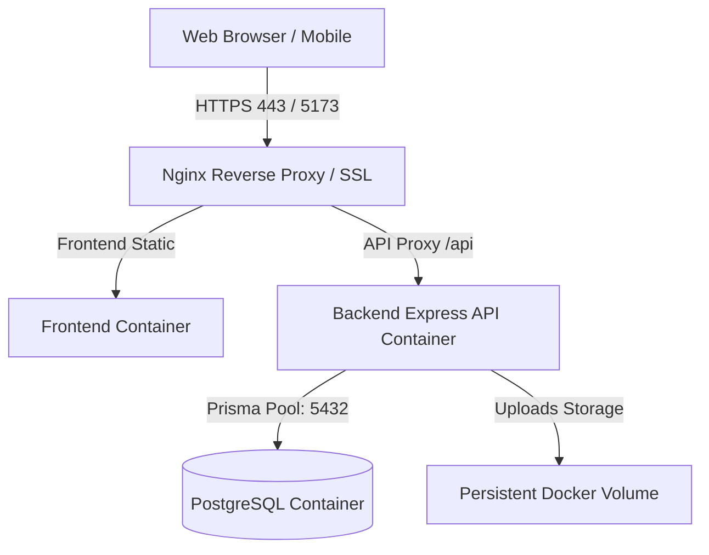

# แผนการพัฒนาระบบบำรุงรักษาเชิงป้องกัน, คลังอะไหล่, บันทึกประวัติการทำงาน และการเตรียมพร้อมขึ้นระบบจริง

## 1. บทนำและวัตถุประสงค์
เพื่อยกระดับระบบ FixFlow CMMS ให้พร้อมใช้งานในระดับอุตสาหกรรม (Industrial Enterprise CMMS) แผนงานนี้ครอบคลุมการพัฒนา 3 ฟีเจอร์หลัก และการเตรียมโครงสร้างพื้นฐานสำหรับ Deployment พร้อมใช้งานจริง

---

## 2. รายละเอียด 3 แผนการพัฒนาหลัก

### แผนที่ 1: ระบบบำรุงรักษาเชิงป้องกัน (Preventive Maintenance - PM Schedule)
- **แนวคิด:** กำหนดรอบเวลาบำรุงรักษาเครื่องจักรล่วงหน้า (Periodic PM) และสร้างใบงานตรวจสอบอัตโนมัติ
- **ฐานข้อมูลที่เกี่ยวข้อง:**
  - สร้างตาราง `pm_schedules` (เก็บ `asset_id`, `title`, `frequency_type`: daily/weekly/monthly/yearly, `interval_value`, `next_due_date`, `assigned_tech_id`, `checklist`)
- **Backend API:**
  - `GET /api/v1/pm-schedules`: ดูรายการแผน PM และปฏิทินงานบำรุงรักษา
  - `POST /api/v1/pm-schedules`: สร้างแผน PM ใหม่พร้อม Checklist ตรวจสอบ
  - `POST /api/v1/pm-schedules/:id/trigger-work-order`: สร้างใบงานสั่งซ่อม (Work Order) ล่วงหน้าจากแผน PM
- **Frontend UI:**
  - หน้า `/pm-schedules`: แสดงปฏิทินแผน PM (Calendar View) และตารางรายการบำรุงรักษาตามรอบของเครื่องจักรแต่ละเครื่อง

---

### แผนที่ 2: ระบบจัดการคลังอะไหล่และการตัดสต็อก (Spare Parts & Inventory Alerts)
- **แนวคิด:** บริหารสต็อกอะไหล่เครื่องจักร แจ้งเตือนเมื่อสต็อกต่ำกว่าเกณฑ์ และตัดยอดอัตโนมัติเมื่อเบิกใช้งานจริง
- **ฐานข้อมูลที่เกี่ยวข้อง:**
  - เพิ่มฟิลด์ `min_stock_qty` (จำนวนขั้นต่ำ), `location_rack` (ตำแหน่งตู้/ชั้นวาง), `supplier_info` ในตาราง `spare_parts`
  - สร้างตาราง `stock_transactions` (บันทึกประวัติการรับเข้า/เบิกออก/ปรับยอด)
- **Backend API:**
  - `GET /api/v1/parts`: รายการอะไหล่ทั้งหมด พร้อมฟิลด์ `is_low_stock` (แจ้งเตือนสต็อกวิกฤต)
  - `POST /api/v1/parts`: เพิ่มรายการอะไหล่ใหม่
  - `POST /api/v1/parts/:id/adjust-stock`: รับเข้า (In) / ปรับยอดสต็อก (Adjustment)
  - ปรับปรุงการอนุมัติใบเบิก `work_order_requisitions` ให้ตัด `stock_qty` จริงใน `spare_parts`
- **Frontend UI:**
  - หน้า `/inventory`: ตารางจัดการสต็อกอะไหล่, ตัวกรอง "อะไหล่ใกล้หมด (Low Stock)", ป้ายเตือนสีแดง, และปุ่มปรับยอดสต็อกด่วน

---

### แผนที่ 3: ระบบบันทึกประวัติการทำงาน (Audit Logs & Traceability)
- **แนวคิด:** บันทึกทุกกิจกรรมสำคัญที่เกิดขึ้นในระบบ เพื่อการตรวจสอบย้อนหลัง (Compliance & Transparency) ตามมาตรฐาน ISO
- **ฐานข้อมูลที่เกี่ยวข้อง:**
  - สร้างตาราง `audit_logs` (เก็บ `user_id`, `user_name`, `action`: CREATE/UPDATE/DELETE/LOGIN/RESET_PASSWORD, `module`: USERS/REQUESTS/ROLES/PARTS, `target_id`, `old_values`, `new_values`, `ip_address`, `timestamp`)
- **Backend Middleware:**
  - Middleware ดักจับและบันทึกประวัติการกระทำอัตโนมัติเมื่อมีการเปลี่ยนแปลงข้อมูลสำคัญ
- **Frontend UI:**
  - หน้า `/audit-logs`: ตารางประวัติกิจกรรมพร้อมระบบค้นหาและกรองตามผู้ใช้งาน, หมวดหมู่, และช่วงเวลา

---

## 3. แผนการเตรียมพร้อมสำหรับการขึ้นระบบจริง (Deployment Readiness)

### 1) Containerization ด้วย Docker & Docker Compose
- สร้าง `Dockerfile` ฝั่ง Frontend (Multi-stage build ด้วย Node.js + Nginx Alpine สำหรับ Serve Production Bundle)
- สร้าง `Dockerfile` ฝั่ง Backend (Node.js Alpine + Prisma Engine)
- สร้าง `docker-compose.yml` รวม 3 Services:
  1. `frontend`: เว็บแอปพลิเคชัน
  2. `backend`: Express API + Socket.io Server
  3. `database`: PostgreSQL 16 พร้อม Persistent Storage Volume

### 2) การตั้งค่า Environment Variables (.env)
- จัดการแยกไฟล์ Configuration สำหรับ Production เช่น `DATABASE_URL`, `JWT_SECRET`, `NODE_ENV=production`, `PORT`

### 3) ฐานข้อมูลและการ Backup ข้อมูลอัตโนมัติ
- คำสั่งรัน Database Migration และ Seeding อัตโนมัติใน Container
- สคริปต์สำรองข้อมูล PostgreSQL (`pg_dump`) รายวัน

---

## 4. แผนการส่งมอบงาน (Phased Implementation Strategy)

1. **Phase 1: Spare Parts & Inventory Management** (สร้างหน้าระบบคลังอะไหล่, ตัดสต็อกจริง, แจ้งเตือน Low Stock)
2. **Phase 2: Preventive Maintenance (PM Schedule)** (สร้างแผนบำรุงรักษาตามรอบ, ปฏิทินงาน PM)
3. **Phase 3: Audit Logs & Activity History** (ระบบบันทึกประวัติการทำงานย้อนหลัง)
4. **Phase 4: Dockerize & Production Deployment Package** (`Dockerfile`, `docker-compose.yml`, Production Scripts)
